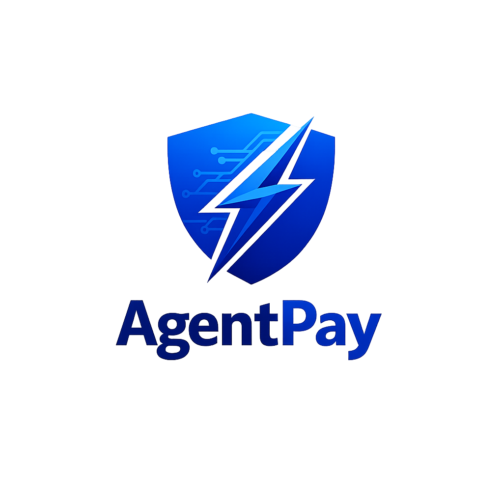

# AgentPay - AI Agent Marketplace

[](https://agentpay.vercel.app)
[](https://rainbowkit.com)
[](https://wagmi.sh)

AgentPay is a decentralized AI agent marketplace powered by x402 micropayments. Connect your wallet, create AI agents with spending limits, and purchase AI services with seamless on-chain transactions.



## Features

- **RainbowKit Wallet Connection** - Connect with MetaMask, WalletConnect, Coinbase, and more
- **Multi-Chain Support** - Base Sepolia and Kite AI networks
- **x402 Micropayments** - Pay-per-use AI services with HTTP 402 protocol
- **AI Agent Management** - Create agents with spending limits and session keys
- **Service Marketplace** - Browse and purchase AI services
- **Kite AI Attestation** - Verified on-chain payment proofs
- **Real-Time Transactions** - Live transaction status and confirmations

## Tech Stack

- **Frontend**: React + TypeScript + Vite
- **Styling**: Tailwind CSS + shadcn/ui
- **Web3**: wagmi + RainbowKit + viem
- **Networks**: Base Sepolia, Kite AI

## Getting Started

### Prerequisites

- Node.js 18+
- A Web3 wallet (MetaMask recommended)
- Base Sepolia testnet ETH

### Installation

```bash
# Clone the repository
git clone https://github.com/yourusername/agentpay.git
cd agentpay

# Install dependencies
npm install

# Start development server
npm run dev
```

### Environment Variables

Create a `.env` file:

```env
VITE_WALLETCONNECT_PROJECT_ID=your_project_id
```

## Usage

1. **Connect Wallet** - Click "Connect" and select your wallet
2. **Create Agent** - Go to "Create Agent" and set spending limits
3. **Browse Services** - Explore AI services in the marketplace
4. **Purchase** - Click on a service and purchase with USDC
5. **Track** - View your purchases in the Dashboard

## Smart Contracts

### Base Sepolia
- USDC: `0x036CbD53842c5426634e7929541eC2318f3dCF7e`
- x402 Payment: `0xabcdef1234567890abcdef1234567890abcdef12`

### Kite AI
- Attestation: `0x1234567890123456789012345678901234567890`

## Deployment

### Vercel

[](https://vercel.com/new/clone?repository-url=https://github.com/yourusername/agentpay)

## License

MIT License - see [LICENSE](./LICENSE) for details

## Contributing

Contributions are welcome! Please read our [Contributing Guide](./CONTRIBUTING.md) for details.

## Support

For support, join our [Discord](https://discord.gg/agentpay) or open an issue.

---

Built with ❤️ by the AgentPay Team
